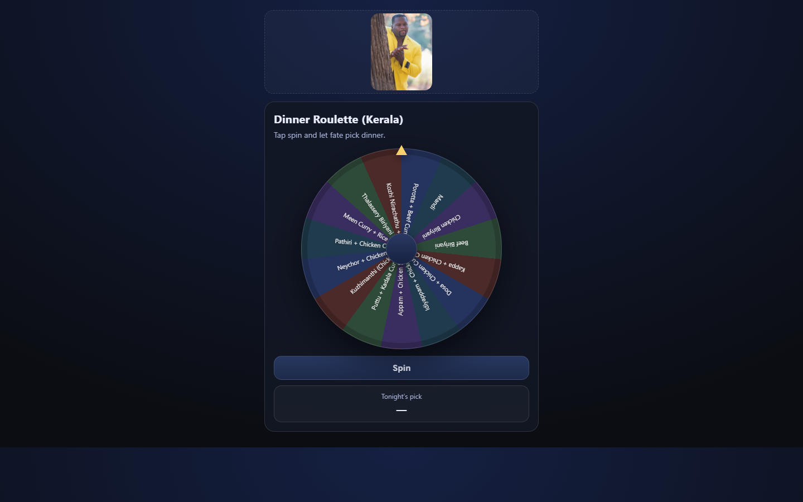
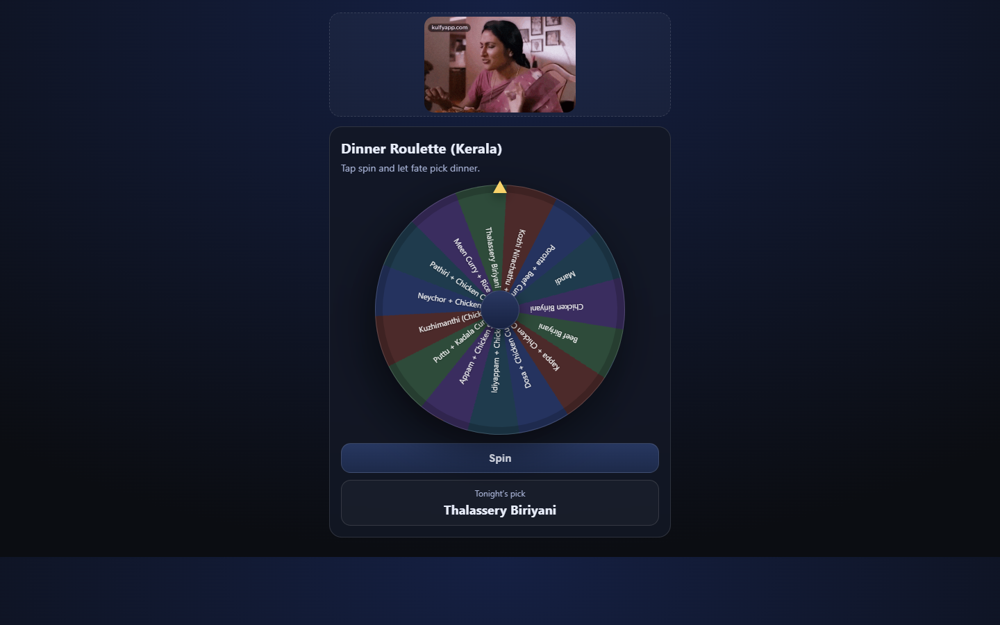
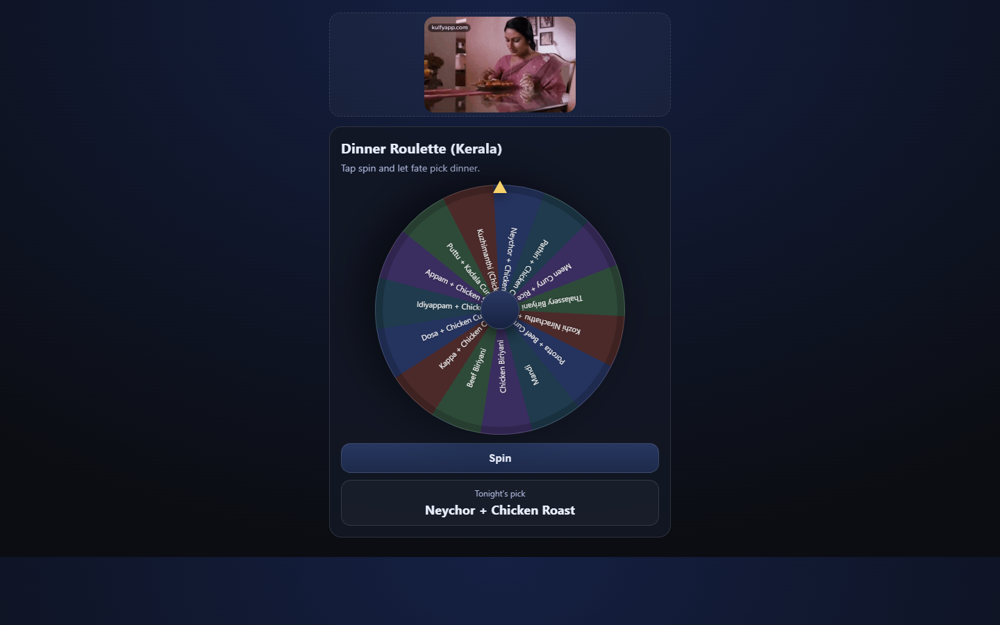

# Dinner Roulette - Kerala Edition

<div align="center">
  
  
  **Can't decide what to eat? Let the roulette decide for you!**
  
  [](https://jolly-rock-0ac28b510.4.azurestaticapps.net)
  [](LICENSE)
</div>

## 📖 About

Dinner Roulette is a fun, interactive web app that helps you decide what to eat from a curated selection of authentic Kerala cuisine dishes. Inspired by the rich culinary heritage of Kerala, India, this roulette wheel features 15 popular dishes ranging from traditional favorites like Appam and Puttu to beloved biryanis and curries.
Live demo: https://jolly-rock-0ac28b510.4.azurestaticapps.net/

Perfect for:
- 🤔 Indecisive foodies who love Kerala cuisine
- 🎉 Making dinner time more exciting
- 📱 Quick decisions on the go (mobile-friendly)
- 👨‍👩‍👧‍👦 Family dinner planning

## ✨ Features

- **🎨 Beautiful UI**: Modern, dark-themed interface with smooth animations
- **🎯 Interactive Roulette Wheel**: Smooth spinning animation with realistic physics
- **📱 Mobile Responsive**: Works seamlessly on desktop, tablet, and mobile devices
- **🎬 Dynamic GIFs**: Changes GIF based on spin state for visual feedback
- **⚡ Lightning Fast**: Single HTML file - no build process required
- **🎭 15 Kerala Dishes**: Carefully curated selection of authentic Kerala cuisine
- **♿ Accessible**: ARIA labels and semantic HTML for better accessibility

## 🖼️ Screenshots

<table>
  <tr>
    <td align="center"><br/><sub><b>Ready to Spin</b></sub></td>
    <td align="center"><br/><sub><b>Spinning Complete - Thalassery Biriyani!</b></sub></td>
    <td align="center"><br/><sub><b>Dinner Decided - Neychor + Chicken Roast!</b></sub></td>
  </tr>
</table>

## 🍛 Available Dishes

- Porotta + Beef Curry
- Mandi
- Chicken Biriyani
- Beef Biriyani
- Kappa + Chicken Curry
- Dosa + Chicken Curry
- Idiyappam + Chicken Stew
- Appam + Chicken Stew
- Puttu + Kadala Curry
- Kuzhimanthi (Chicken)
- Neychor + Chicken Roast
- Pathiri + Chicken Curry
- Meen Curry + Rice
- Thalassery Biriyani
- Kozhi Nirachathu + Rice

## 🚀 Quick Start

### Option 1: Open Directly (Simplest)
Just double-click `index.html` - it works in any modern browser!

### Option 2: Local Server (Recommended for Mobile)

#### Using Node/npx:
```bash
npx serve . -l 4173
```

Then open `http://localhost:4173` in your browser.

#### Using Python:
```bash
python -m http.server 4173
```

### Option 3: Access on Mobile
1. Start a local server (see above)
2. Find your PC's IP address (`ipconfig` on Windows, `ifconfig` on Mac/Linux)
3. Open `http://<YOUR_PC_IP>:4173` on your phone (must be on same Wi-Fi)

## 🎨 Customization

### Change Dinner Options
Edit the `options` array in `index.html`:

```javascript
const options = [
  "Your Dish 1",
  "Your Dish 2",
  // ... add your dishes
];
```

**Note**: Keep 15 items for equal slice distribution, or adjust the wheel generation logic accordingly.

### Customize GIFs
Replace the GIF URLs in `index.html`:

```javascript
const DEFAULT_GIF = "your-default-gif-url";
const SELECTED_GIF = "your-celebration-gif-url";
```

### Modify Colors
Update CSS variables in the `:root` section:

```css
:root {
  --bg: #0b0d12;
  --card: #121724;
  --text: #e9eefc;
  /* ... other colors */
}
```

## 🌐 Deployment

### Deploy to Azure Static Web Apps

This project includes a GitHub Actions workflow for automatic deployment.

1. **Fork/Clone this repository**

2. **Create an Azure Static Web App**
   - Go to [Azure Portal](https://portal.azure.com)
   - Create a new Static Web App resource
   - Copy the deployment token

3. **Add GitHub Secret**
   - Go to your repo → Settings → Secrets and variables → Actions
   - Create new secret: `AZURE_STATIC_WEB_APPS_API_TOKEN`
   - Paste your deployment token

4. **Push to main branch** - Automatic deployment will trigger!

### Other Hosting Options
- **GitHub Pages**: Enable in repo settings
- **Netlify**: Drag and drop the folder
- **Vercel**: Import the GitHub repository

## 🛠️ Technical Details

- **Framework**: Vanilla JavaScript (no dependencies!)
- **Styling**: Pure CSS with modern features
- **Build**: None required - single HTML file
- **Browser Support**: All modern browsers (Chrome, Firefox, Safari, Edge)
- **File Size**: ~15KB total

## 📂 Project Structure

```
dinner-roulette/
├── index.html              # Main application file (HTML + CSS + JS)
├── README.md              # This file
├── screenshots/           # App screenshots
└── .github/
    └── workflows/
        └── azure-static-web-apps.yml  # CI/CD workflow
```

## 🤝 Contributing

Contributions are welcome! Feel free to:
- Add more Kerala dishes
- Improve the UI/UX
- Fix bugs
- Enhance accessibility
- Add new features

## 📝 License

This project is open source and available under the [MIT License](LICENSE).

## 👨‍💻 Author

**Rohan Krishna Ullas**
- GitHub: [@rohankrishnaullas](https://github.com/rohankrishnaullas)

## 🙏 Acknowledgments

- Inspired by the rich culinary tradition of Kerala, India
- GIFs from Tenor
- Built with ❤️ for food lovers

---

<div align="center">
  Made with 💚 in Kerala | <a href="#-dinner-roulette---kerala-edition">Back to Top ↑</a>
</div>
